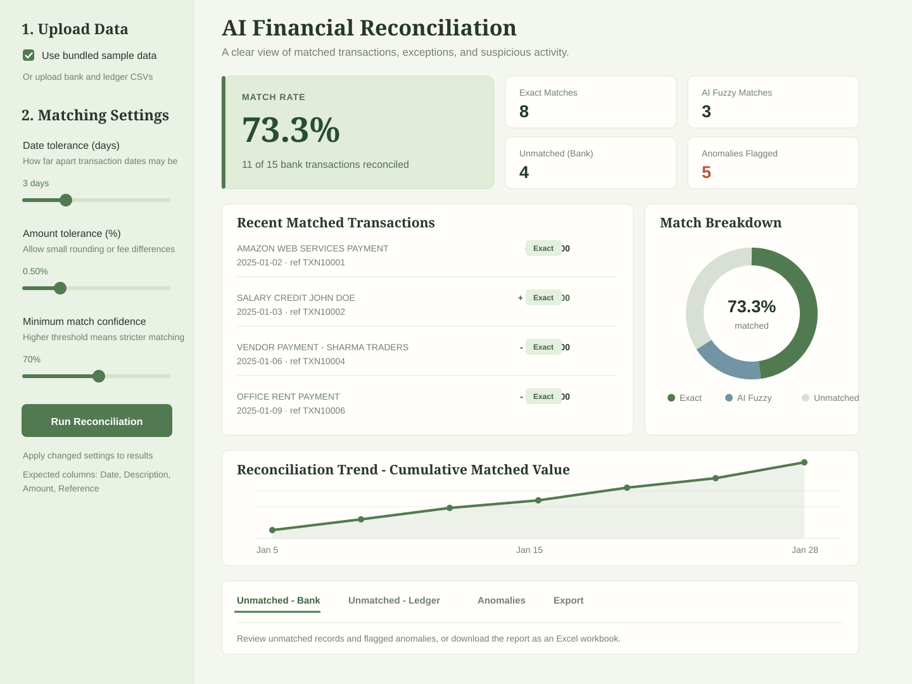

# AI-Based Financial Reconciliation System

An end-to-end system that automatically reconciles transactions between a **bank statement**
and an internal **ledger**, even when descriptions are worded differently, dates are off by a
day or two, or amounts differ by small rounding errors. Unmatched and suspicious transactions
are flagged for human review.

This matches the architecture described in the patent IDF:
`Data Sources → Ingestion → Preprocessing → AI Matching Engine → Anomaly Detection → Dashboard`.

## Streamlit dashboard walkthrough

The illustration below shows the main dashboard sections using the bundled sample data.



- **Upload Data** — use the included demo CSVs or upload a bank statement and ledger of your own.
- **Matching Settings** — set the allowed date difference, amount variance, and minimum confidence for fuzzy matches. Click **Run Reconciliation** to apply changed settings.
- **Match Rate and summary metrics** — see the percentage of bank transactions reconciled, with counts for exact matches, AI fuzzy matches, unmatched bank entries, and flagged anomalies.
- **Recent Matched Transactions** — review matched bank entries, dates, references, amounts, and whether each match was exact or fuzzy.
- **Match Breakdown** — compare exact, fuzzy, and unmatched bank transactions at a glance.
- **Reconciliation Trend** — follow the cumulative value of matched transactions over time.
- **Review and Export tabs** — inspect unmatched bank entries, unmatched ledger entries, and anomalies; use the Export tab to download the complete report as an Excel workbook.

## How the matching actually works (no black box)

1. **Exact pass** — transactions with identical amount + identical date are auto-matched
   instantly (100% confidence).
2. **AI fuzzy pass** — everything left over is scored pairwise on three signals, combined into
   one weighted confidence score:
   - **Text similarity** of the (normalized) description — e.g. "VENDOR PAYMT SHARMA TRADER"
     vs "Sharma Traders Payment" still scores highly similar.
   - **Date closeness** within a configurable tolerance window (handles bank-vs-book timing lag).
   - **Amount closeness** within a configurable tolerance (handles rounding/fee differences).

   Pairs above the confidence threshold are matched greedily, highest-confidence first,
   one-to-one (a transaction can't be "used" in two matches).
3. **Anomaly detection** — runs on top of the matching result:
   - An **Isolation Forest** (unsupervised ML, from scikit-learn) flags statistically unusual
     transaction amounts.
   - A **duplicate-payment check** flags same-amount transactions whose descriptions are highly
     similar — catching accidental double payments even when the wording isn't identical.

This is genuinely testable logic (not hand-waved) — see `sample_data/` and the test run below.

## Project structure

```
recon_project/
├── app.py                        # Streamlit dashboard (the UI)
├── reconciliation/
│   ├── __init__.py
│   └── matcher.py                 # Core matching + anomaly detection engine
├── sample_data/
│   ├── bank_statement.csv         # Demo data (15 transactions, some messy on purpose)
│   └── ledger.csv                 # Demo data (13 transactions)
├── requirements.txt
└── README.md
```

## Running it

```bash
pip install -r requirements.txt
streamlit run app.py
```

This opens a local web dashboard at `http://localhost:8501`. Tick **"Use bundled sample data"**
in the sidebar to see a working demo immediately, or uncheck it and upload your own
`Date, Description, Amount, Reference` CSV files for the bank statement and ledger.


